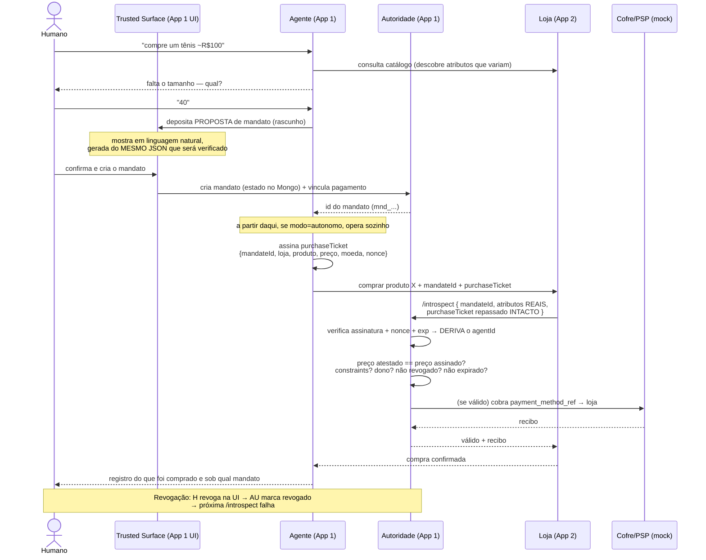

# 02 — Arquitetura

## Os papéis (não são só 2)

A intuição errada é pensar "agente ↔ loja". O sistema tem **quatro papéis**, e a separação entre eles é a segurança inteira.

| Papel | Onde vive | O que faz | O que NÃO faz |
|---|---|---|---|
| **Humano** | UI do App 1 | Cria e revoga o mandato; vincula o método de pagamento; confirma na Trusted Surface | — |
| **Autoridade de Mandato** | App 1 (backend) | Guarda o estado, a chave/ref do pagamento; **verifica** constraints; **revoga**; **dispara** o pagamento; é a única a **escrever** o estado | Nunca vende, nunca navega, nunca "conversa" |
| **Agente** | App 1 (backend, papel separado) | Conversa com o humano, **rascunha** a proposta de mandato, busca/compara nas lojas, executa a compra carregando o **id** do mandato | Nunca cria/alarga mandato; nunca escreve o estado; nunca decide se a compra é válida; nunca vê o instrumento de pagamento |
| **Loja (merchant)** | App 2 (×2) | Descreve os próprios produtos num vocabulário comum; recebe a tentativa de compra; **repassa intacto** o bilhete assinado do agente; **chama a Autoridade** para verificar | Nunca conhece as constraints do cliente; nunca julga; **nunca afirma quem é o agente** — ela transporta a prova, não a produz |

> **Fronteira interna crítica do App 1:** Agente e Autoridade compartilham o deploy, mas são papéis separados. O Agente **lê** um id; a Autoridade **escreve** o estado. O Agente **não tem caminho de escrita** para o estado do mandato nem para a revogação. Se questionado ("o agente e a autoridade são o mesmo app, o que impede ele de se autorizar?"), a defesa é: *o estado de autorização só é escrito pelo humano, via a Trusted Surface; o agente só lê um token; a verificação e a revogação leem esse estado; o agente não tem caminho de escrita nele.*

## Abordagem de verificação escolhida: **B (referência opaca + introspecção)**

O "token" que o agente carrega é um **id opaco** de alta entropia (ex.: `mnd_9f3a...`), **não** um JWT assinado com os limites dentro. Quando a loja precisa verificar, ela **chama** o endpoint `/introspect` da Autoridade, que resolve tudo no servidor (existe? não revogado? não expirado? constraints batem? agente é o dono?).

Por que B e não A (JWT assinado, estilo AP2): **revogação ao vivo trivial** (uma flag lida na próxima consulta), **selective disclosure** (a loja só pergunta "cabe?", não vê os limites) e **menos superfície de cripto** para dar errado na demo. Trade-off aceito: uma chamada de rede por compra e dependência da Autoridade estar de pé. Ver §2.2 em `docs/DECISION-LOG.md`.

**Escala:** ver `docs/08-scaling.md`.

## Fluxo de ponta a ponta

## Modelo de confiança

- **Loja → Autoridade:** a loja confia porque **chama** a Autoridade e ela responde (introspecção). Não há assinatura para verificar offline.
- **Autoridade → Loja:** a Autoridade só fala com lojas **registradas e autenticadas** (allow-list de merchants + mTLS/chave). Uma loja falsa/não-registrada não participa do fluxo — é o mecanismo anti-site-fake. (Nota: a discussão sobre uma *credenciadora* externa foi deixada de fora do escopo; aqui as lojas são um registro confiável mantido pela própria Autoridade.)
- **Agente → Autoridade:** o agente **prova** quem é assinando um `purchaseTicket` por tentativa (HMAC com segredo que só ele e a Autoridade conhecem), descrevendo exatamente a compra pedida. A loja repassa o bilhete intacto e a Autoridade o verifica ela mesma: o `agentId` é **derivado do bilhete**, nunca lido de um campo do corpo — nem do corpo do agente, nem do da loja.
  > Por que não basta a loja autenticar o agente e contar à Autoridade: uma loja registrada que atendeu uma compra legítima conhece `mandateId` e `agentId`, e poderia cobrar a titular depois, **sem agente nenhum**. Ver §2.7 em `docs/DECISION-LOG.md`.
- **Humano → tudo:** a raiz da autorização. Só o humano cria/alarga/revoga mandato, na Trusted Surface, num ponto que o agente não alcança.

## Onde a IA entra (e onde não entra)

- **IA rascunha, determinístico decide.** O Agente (LLM) conversa, interpreta a intenção, descobre quais atributos importam e monta a *proposta*. A **verificação** na transação é 100% determinística (motor de constraints, comparação de strings/números). Nenhum LLM no caminho crítico do dinheiro.
- Reconciliação semântica de nomes de atributo (ex.: `liga` ≈ `liga_cimento`), **se** existir, roda no **cadastro da loja** (offline, com revisão humana) e é congelada como mapa determinístico — nunca na hora da transação. Ver `docs/DECISION-LOG.md`.

## Diagrama de arquitetura (para o deliverable)

Para o deliverable "Architecture diagram", produza uma versão visual (draw.io / Excalidraw / Mermaid exportado) contendo: os 4 papéis, a fronteira interna do App 1 (Agente vs Autoridade), a chamada de introspecção Loja→Autoridade, o disparo de pagamento Autoridade→Cofre, e o loop de revogação Humano→Autoridade. O `sequenceDiagram` acima serve de base.
